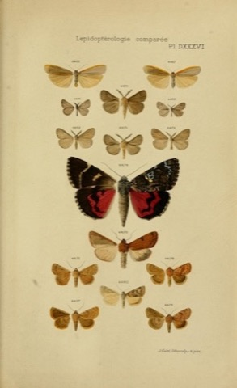

# Biodiversity Library Illustrations

[Biodiversity Library](https://www.biodiversitylibrary.org) provides high resolution scans of old biology-related books. The coolest thing about these scans is that they contain beautiful plant and animal illustrations (some curated subset of them is hosted on [Flickr](https://www.flickr.com/photos/biodivlibrary/), although in lower resolution). 




Biodiversity Library provides an API to access high resolution images of these scans programatically. However, vast majority of pages provided are not illustrations, but just plain text. Fortunately, Biodiversity Library also provides [files with page annotations](https://about.biodiversitylibrary.org/tools-and-services/developer-and-data-tools/). These annotations in general classify pages by content. They are quite noisy though, so under label "Illustration" there are various images which either don't fit into category or are of lower quality.


Ideally, I would want to have datasets of exclusively high quality illustrations. To do that I trained a binary DNN classifier which classifies images into higher and lower quality ones.

| Classified as high quality (HQ) (~110k images)| Classified as low quality (LQ) |
|:-------------:|:------:|
|  |  |

# How to get high quality illustrations

If you don't care about the whole story, here's how to download just high quality illustrations. In total it's ~112k images, 100-150GBs.

1. Clone this repo.
2. Run

```
python3 download_illustrations.py hq_illustrations.txt
                                 --output_dir ALL_ILLUSTRATIONS_DIR
                                 [--start_index START_INDEX]
                                 [--max_count MAX_COUNT]
                                 [--thread_count THREAD_COUNT]
```

3. Enjoy!

# Training a classifier

## 1. Downloading all the illustration pages

As a first step we have to download all the pages marked as 'Illustration' in the provided annotation file. To do that:

1. Download page file from BiodiversityLibrary [here](https://www.biodiversitylibrary.org/data/data.zip). You have to download the whole archive, which is around 2.8GB, the page file is few gigs as well.

2. Extract __page/image ids__ of illustrations from the page file. This will produce a text file with a list of page/image ids which contain illustrations.
```
python3 extract_illustrations.py PAGE_FILE --output_file ILLUSTRATIONS_FILE
```

3. Download illustrations (it should be around 280k images, ~300GB)
```
python3 download_illustrations.py ILLUSTRATIONS_FILE
                                 --output_dir ALL_ILLUSTRATIONS_DIR
                                 [--start_index START_INDEX]
                                 [--max_count MAX_COUNT]
                                 [--thread_count THREAD_COUNT]
```

After this we should have jpegs of illustrations pages in `ALL_ILLUSTRATIONS_DIR`.

## 2. Getting an initial train set and unlabeled data set

Generally, to train DNN we want a train set and some sort of validation/test set to check the trained model's accuracy. However, since I'm lazy and labeling is boring, I just created a small train set (initial size 1k images), which I labeled manually with labels for three classes - __HQ, LQ, NOT SURE__. To check the model's accuracy I selected 10k of unlabeled images on which I'm going to visually check the model's accuracy and also use the set to expand the training set with additional samples.

Select random 1k samples for train set:

```
ls ALL_ILLUSTRATIONS_DIR | sort -R | head -1000 | xargs -I {} cp ALL_ILLUSTRATIONS_DIR/{} TRAIN_SET_DIR
```

Select random 10k samples for unlabeled set:

```
ls ALL_ILLUSTRATIONS_DIR | sort -R | head -10000 | xargs -I {} cp ALL_ILLUSTRATIONS_DIR/{} UNLABELED_SET_DIR
```

Label the train set:

```
python3 classifier/label.py TRAIN_SET_DIR --output_file LABEL_FILE
```

I found __NOT SURE__ class pretty useful. In case I'm not sure during labeling if the image is HQ or LQ, I can just skip it and later revisit the sample, also seeing what does ensemble predict.

## 3. Iteratively improving the classifer

The goal is to get the best classifier with the least amount of labeling effort. To do that, we're going to do following:

1. Train an ensemble `N` on a train set `N`
2. Check predictions of the ensemble on train set `N` and unlabeled set
3. Create train set `N + 1` by changing some of train set `N` labels or adding data from unlabeled set
4. `N++` and Go to step 1 

### 1. Train an ensemble

The plan is to iteratively grow my train set based on already trained classifier and in that way iteratively improve classifier themselves. Ideally, we want to add only informative samples to training set, so it's useful to have prediction uncertainty estimates. Uncertainty estimates are fairly difficult to get from a single model, it's more useful to train a whole ensemble of models (yes, using dropout is sort of the same as training ensemble, but not quite as good). This also improves overall accuracy of predictions. Considering that the training time is pretty low (~7-8 minutes on 1070GTX), training an ensemble of 5 models is still quite reasonable time-wise and doesn't slow the overall workflow too much.

```
python3 classifier/train.py --image_dir TRAIN_SET_DIR --labels ITERATION_N_DIR/LABEL_FILE --epochs EPOCHS --output ITERATION_N_DIR/TRAINED_MODEL_PATH_I --pretrained_model ITERATION_N-1_DIR/TRAINED_MODEL_PATH_I
```

- `N` is iteration number
- `I` is index of a model in the ensemble

Note that each iteration we're using weights from models trained in previous iteration.

### 2. Check predictions on train and unlabeled sets

Once an ensemble is trained, we want to analyze its predictions both on train set and unlabeled set.

```
python3 classifier/infer.py --image_dir TRAIN_SET_DIR --model ITERATION_N_DIR/TRAINED_MODEL_PATH_I --output ITERATION_N_DIR/INFERENCE_OUTPUT_TRAIN_I
python3 classifier/infer.py --image_dir UNLABELED_SET_DIR --model ITERATION_N_DIR/TRAINED_MODEL_PATH_I --output ITERATION_N_DIR/INFERENCE_OUTPUT_UNLABELED_I
```

Now we can have a look at predictions. We're going to be looking for samples which either have incorrect label or new samples which might improve model accuracy. To do that, I categorize predictions into multiple categories. 

### __Unlabeled Prediction Types__

|              | Ensemble agrees | Ensemble disagrees |
|--------------|:-------------:|:------:|
| __Low entropy__  |  type A | type C |
| __High entropy__ |  type B | type D |

- `A` - Easy cases, not interesting, maybe for keeping the data distribution roughly correct 
- `B` - Interesting cases, many of them would fall into "not sure" category. Can add this to training set as uncertain samples (so should be informative).
- `C` - Entropy here is way bigger than for predictions where ensemble agrees. Ensemble prediction is usually right. Can use this to add some auto-labeled data, still useful because some models predicted wrong.
- `D` - Interesting cases, similar to type C. Ensemble prediction not necessarily right.  Can add this to training set as uncertain samples (so should be informative).

### *Train Prediction Types:*
- `NOTSURE` - *low_entropy, label NOTSURE* - almost surely correctly predicted, makes sense to add ones where some model in ensemble mispredicts. This helps decide if the image is HQ or LQ.
- `MISPREDICTION` - *mispredicted on train set at least with one model* - potential for mislabel detection.
- `UNCERTAIN` - *high entropy, correctly predicted* - potential for mislabel detection.

To get predictions in all these categories we can run jupyter notebook `classifier/DataAnalysis.ipynb`.

### *Files produced by the notebook*

- `relabels_notsure.json` - have to manually filter out (in notebook) predictions which were not correctly predicted by ensemble.
- `relabels_type_c.json` -  have to manually filter out (in notebook) predictions which were not correctly predicted by ensemble. 
- `relabels_type_b_d.json` - no manual intervention needed

For `UNCERTAIN` and `MISPREDICTION` predictions we don't produce any files since these predictions point to mislabels and so they have to be manually fixed in labels JSON for the next iteration. Note that these usually include very few samples <10 so manually fixing them is not a problem. Also, with later iterations, they are basically non-existent.

### 3. Update the train set

Create a directory for new iteration - `ITERATION_N+1_DIR`. Now we can use the files produced by Data Analysis notebook to create labels for next iteration:

```
python3 classifier/update_labels.py --input_labels ITERATION_N_DIR/LABEL_FILE --label_update
                        ITERATION_N_DIR/relabels_notsure.json --output_file TERATION_N+1_DIR/LABEL_FILE
python3 classifier/update_labels.py --input_labels ITERATION_N+1_DIR/LABEL_FILE --label_update
                        ITERATION_N_DIR/relabels_type_c.json --output_file TERATION_N+1_DIR/LABEL_FILE
```

We also have to update our train set image directory:

```
python3 update_images.py --label_update ITERATION_N_DIR/relabels_type_c.json --src_img_dir
                        UNLABELED_SET_DIR --dst_img_dir TRAIN_SET_DIR
python3 update_images.py --label_update ITERATION_N_DIR/relabels_type_b_d.json --src_img_dir
                        UNLABELED_SET_DIR --dst_img_dir TRAIN_SET_DIR
```

Since for types `B` and `D` we don't have labels (the ensemble predictions are unreliable, that's why the samples are useful), we have to label them ourselves.

```
python3 classifier/label.py TRAIN_SET_DIR --output_file ITERATION_N+1_DIR/LABEL_FILE
```

Now it's also time to fix labels for `MISPREDICTIONS` and `UNCERTAIN` predictions.

*Note*: In later iterations I usually skipped some files. For example for last 2-3 iterations I didn't use type `C` and type `B+D` predictions at all, I just updated the samples in training set.

## 4. When to stop

Since there's no quantitative metric in my experiment, I just stopped when I felt that the ensemble's behavior on unlabeled set is good enough (e.g. most of the predictions even with high entropy are correct). The classifier doesn't have to be perfect, it just has to be good enough.

Out of curiosity, I retrospectively analyzed the prediction files produced across iteration. I looked at how confident/stable ensemble predictions on unlabeled set were across iterations:

### "Change of mind" - difference in model predictions in consecutive iteration

### "Change of mind" - difference in ensemble predictions in consecutive iteration

### Entropy of model's outputs

### Disagreement in ensemble predictions


## Notes

__I haven't mentioned hyperparameter optimization, model's architecture, optimizer algorithm, batch size etc. I haven't mentioned them not because I forgot, but because those parameters are secondary to the data you feed your model. *The best way to improve your model is to improve your training data*.__